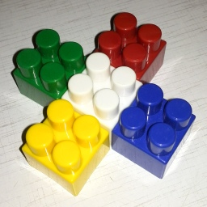
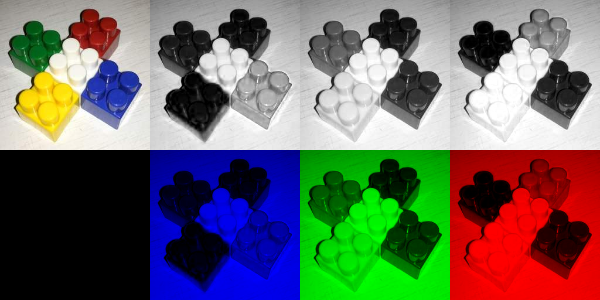
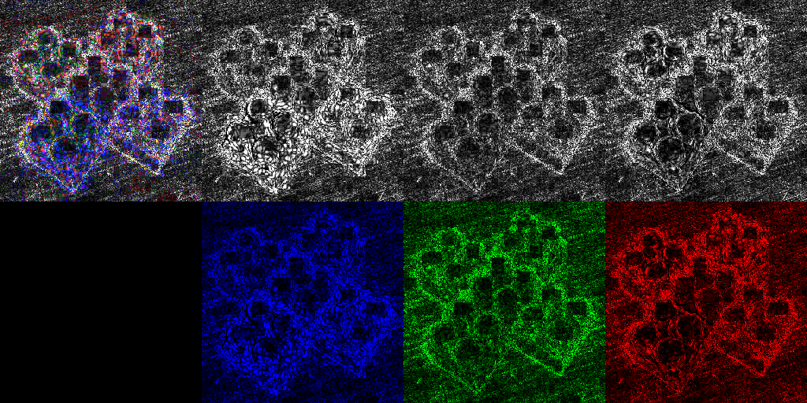

## Работа 1. Исследование гамма-коррекции
автор: Кочнев Р.Ю.

 url: https://gitlab.com/mind2cloud/kochnev_r_u/-/tree/master/lab_2

### Задание
Для исходного изображения (сохраненного без потерь) создать jpeg версии с двумя уровнями качества (например, 95 и 65). Вычислить и визуализировать на одной “мозаике” исходное изображение, результаты сжатия, поканальные и яркостные различия.

### Результаты

Рис 1. Исходное изображение

Рис 2. Результаты работы программы

### Текст программы

#include <opencv2/opencv.hpp>
using namespace cv;

#include <iostream>
#include <string>
#include <opencv2/core.hpp>
#include <opencv2/highgui.hpp>

using cv::Mat;
using cv::Rect;
using std::vector;
using std::string;

int cRate_1 = 95;
int cRate_2 = 65;

string image_1 = "image_" + std::to_string(cRate_1) + ".jpeg";
string image_2 = "image_" + std::to_string(cRate_2) + ".jpeg";

Mat BImage(Mat image, uint color_ind) {
    vector<Mat> channels;
    split(image, channels);
    vector<Mat> to_merge;
    for (int i = 0; i < 3; i++) {
        to_merge.push_back(channels[color_ind]);
    }
    Mat one_color_image = Mat::zeros(image.size[0], image.size[1], CV_8UC3);
    merge(to_merge, one_color_image);
    return one_color_image;
}

Mat ColorImage(Mat image, uint color_ind) {
    vector<Mat> channels;
    split(image, channels);
    Mat mask = Mat::zeros(image.size[0], image.size[1], CV_8UC1);
    vector<Mat> to_merge;
    for (int i = 0; i < 3; i++) {
        if (i == color_ind) {
            to_merge.push_back(channels[color_ind]);
        }
        else {
            to_merge.push_back(mask);
        }
    }
    Mat one_color_image = Mat::zeros(image.size[0], image.size[1], CV_8UC3);
    merge(to_merge, one_color_image);
    return one_color_image;
}

void compress_image(Mat image) {
    imwrite(image_1, image, vector<int>({cv::IMWRITE_JPEG_QUALITY, cRate_1}));
    imwrite(image_2, image, vector<int>({cv::IMWRITE_JPEG_QUALITY, cRate_2}));
}

Mat Lab2(Mat image) {
    Mat display = Mat::zeros(image.rows * 2, image.cols * 4, CV_8UC3);
    auto rect = Rect(0, 0, image.size[0], image.size[1]);
    auto roi = display(rect);
    image.copyTo(roi);

    for (int i = 1; i <= 3; i++) {
        auto rect = Rect(256 * i, 0, image.size[0], image.size[1]);
        auto roi = display(rect);
        Mat img = BImage(image, i - 1);
        img.copyTo(roi);
    }
    
    for (int i = 1; i <= 3; i++) {
        auto rect = Rect(256 * i, 256, image.size[0], image.size[1]);
        auto roi = display(rect);
        Mat img = ColorImage(image, i - 1);
        img.copyTo(roi);
    }
    return display;
}

int main() {
    Mat image = imread("image.png", cv::IMREAD_COLOR);
    compress_image(image);

    string name_1 = "image_" + std::to_string(cRate_1);
    string name_2 = "image_" + std::to_string(cRate_2);
    
    Mat comp_img_1 = imread(image_1, cv::IMREAD_COLOR);
    Mat comp_img_1_gray = imread(image_1, cv::IMREAD_GRAYSCALE);
    Mat result_1 = Lab2(comp_img_1);
    imshow(name_1, result_1);
    
    Mat comp_img_2 = imread(image_2, cv::IMREAD_COLOR);
    Mat comp_img_2_gray = imread(image_2, cv::IMREAD_GRAYSCALE);
    Mat result_2 = Lab2(comp_img_2);
    imshow(name_2, result_2);
    
    Mat diff = cv::abs(result_1 - result_2) * 20;
    imshow("diff", diff);
    
    Mat grey_diff = cv::abs(comp_img_1_gray - comp_img_2_gray) * 20;
    imshow("grayscale diff", grey_diff);
    
    imwrite(name_1 + ".png", result_1);
    imwrite(name_2 + ".png", result_2);
    imwrite("var.png", diff);
    imwrite("gvar.png", grey_diff);
}