автор: Кочнев Р.Ю.

 url: https://gitlab.com/mind2cloud/kochnev_r_u/-/tree/master/lab_3

### Задание
Подобрать и зачитать небольшое изображение $S$ в градациях серого.
Построить и нарисовать гистограмму $H_s$ распределения яркости пикселей исходного изображения.
Сгенерировать табличную функцию преобразования яркости. Построить график $V$ табличной функции преобразования яркости.
Применить табличную функцию преобразования яркости к исходному изображению и получить $L$, нарисовать гистограмму $H_L$ преобразованного изображения.
Применить CLAHE с тремя разными наборами параметров (визуализировать обработанные изображения $C_i$ и их гистограммы $H_{C_{i}}$).
Реализовать глобальный метод бинаризации (подобрать порог по гистограмме, применить пороговую бинаризацию). Визуализировать на одном изображении исходное $S$ и бинаризованное $B_G$ изображения.
Реализовать метод локальной бинаризации. Визуализировать на одном изображении исходное $S$ и бинаризованное $B_L$ изображения.
Улучшить одну из бинаризаций путем применения морфологических фильтров. Визуализировать на одном изображении бинарное изображение до и после фильтрации $M$.
Сделать визуализацию $K$ бинарной маски после морфологических фильтров поверх исходного изображения (могут помочь подсветка цветом и альфа-блендинг).

### Результаты

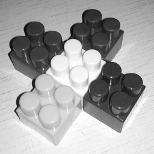
Рис. 1. Исходное полутоновое изображение $S$
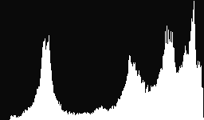
Рис. 2. Гистограмма $H_s$ исходного полутонового изображения $S$
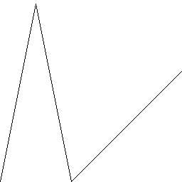
Рис. 3. Визуализация функции преобразования $V$
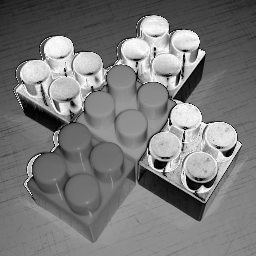
Рис. 4.1. Таблично пребразованное изображение $L$
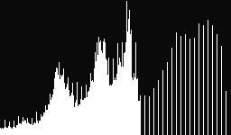
Рис. 4.2. Гистограмма $H_L$ таблично-пребразованного изображения $L$
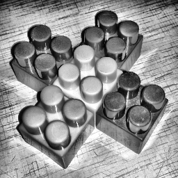
Рис. 5.1. Преобразование $C_1$ CLAHE с параметрами Size(8, 8)
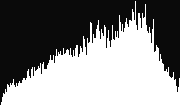
Рис. 5.2. Гистограмма $H_{C_{1}}$
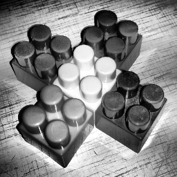
Рис. 5.3. Преобразование $C_2$ CLAHE с параметрами Size(2, 8)
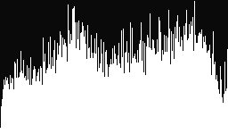
Рис. 5.4. Гистограмма $H_{C_{2}}$
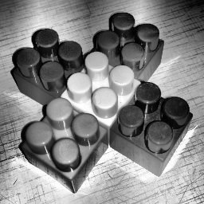
Рис. 5.5. Преобразование $C_3$ CLAHE с параметрами Size(8, 2)
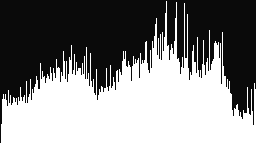
Рис. 5.6. Гистограмма $H_{C_{3}}$
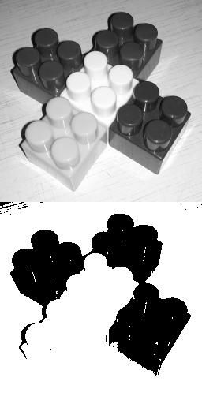
Рис. 6. Изображение $S$ до и $B_G$ после глобальной бинаризации
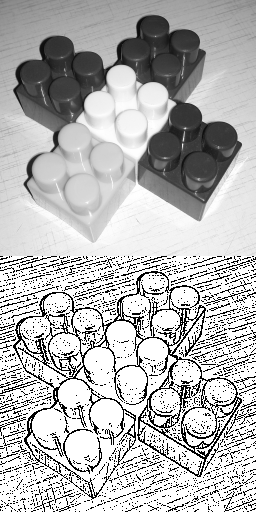
Рис. 7. Изображение $S$ до и $B_L$ после локальной бинаризации
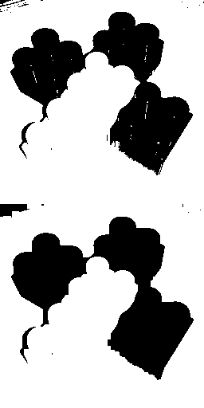
Рис. 8. До и после морфологической фильтрации $M$
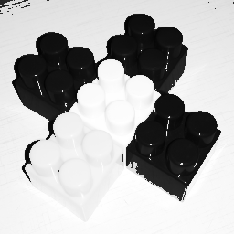
Рис. 9. Визуализация маски $K$

### Текст программы

#include <opencv2/opencv.hpp>

using namespace cv;
using namespace std;

void drHist(Mat gray_image, int hist_size, string filename) {
    //
    array<int, 256> hist{ 0 };
    for (int j_row = 0; j_row < gray_image.rows; j_row++) {
        for (int i_col = 0; i_col < gray_image.cols; i_col++) {
            hist[gray_image.at<uint8_t>(j_row, i_col)] += 1; // -
        }
    }

    //     Y
    int max = 0;
    for (int i = 0; i < 256; i++)
    {
        if (max < hist[i])
        {
            max = hist[i];
        }
    }
    
    float y_scale = (1.0 * hist_size / max); //
    Mat histogram(hist_size, 256, CV_8UC1, Scalar(255, 0, 0));
    for (int x = 0; x < 256; x++) {
        line(histogram, Point(x, 0), Point(x, hist_size - y_scale * hist[x]), Scalar(10, 255, 255), 1); //,
    }
    
    imwrite(filename, histogram);
}

int brightless(int x){
    if (x <= 50) {
        return(5 * x);
    }
    if ((x > 50) && (x < 100)){
        return(-5 * (x - 50) + 250);
    }
    if (x >= 100){
        return(x - 100);
    }
}

int main()
{
    String path = "";
    Mat initialImage = imread(path + "source.jpg");
    Mat gray_image;
    cvtColor(initialImage, gray_image, COLOR_BGR2GRAY);

    Mat binary_mask;
    double alpha = 0.7; double beta = (1.0 - alpha);
    addWeighted(global_binarization_image, alpha, gray_image, beta, 0.0, binary_mask);
    imwrite(path + "localbin.png", binary_mask);
    
    waitKey(0);
    return 0;
}