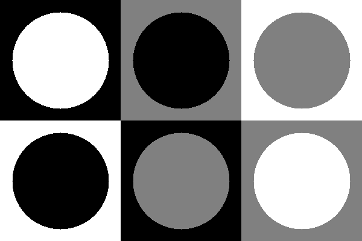
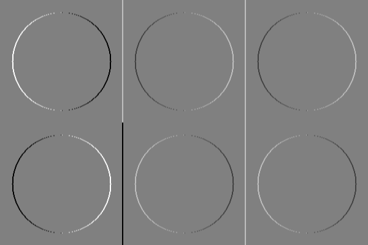
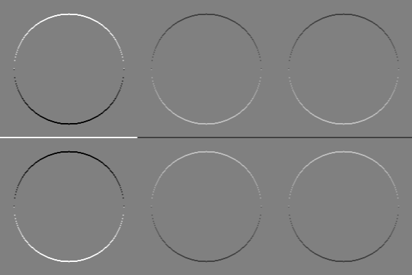
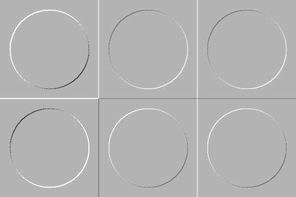

автор: Кочнев Р.Ю.

 url: https://gitlab.com/mind2cloud/kochnev_r_u/-/tree/master/lab_4

### Задание
Сгенерировать серое тестовое изображение из квадратов и кругов с разными уровнями яркости (0, 127 и 255) так, чтобы присутствовали все сочетания.
Применить первый линейный фильтр и сделать визуализацию результата $F_1$.
Применить второй линейный фильтр и сделать визуализацию результата $F_2$.
Вычислить $R=\sqrt{F_1^2 + F_2^2}$  и сделать визуализацию R.

### Результаты

Рис. 1. Исходное тестовое изображение

Рис. 2. Визуализация результата $F_1$ применения фильтра

Рис. 3. Визуализация результата $F_2$ применения фильтра

Рис. 4. Визуализация модуля градиента $R$

### Текст программы

#include <opencv2/opencv.hpp>

int main()
{
    Mat full_img(320, 750, CV_8UC1, Scalar(255));
    int w = 250;
    int h = 160;
    Mat roi_1 = full_img(Rect(0, 0, w, h));
    Mat img_1 = imageCr(127, 0);
    img_1.copyTo(roi_1);

    Mat roi_2 = full_img(Rect(0, h, w, h));
    Mat img_2 = imageCr(255, 0);
    img_2.copyTo(roi_2);
    
    Mat roi_3 = full_img(Rect(w, 0, w, h));
    Mat img_3 = imageCr(0, 255);
    img_3.copyTo(roi_3);
    
    Mat roi_4 = full_img(Rect(2 * w, 0, w, h));
    Mat img_4 = imageCr(255, 127);
    img_4.copyTo(roi_4);
    
    Mat roi_5 = full_img(Rect(w, h, w, h));
    Mat img_5 = imageCr(127, 255);
    img_5.copyTo(roi_5);
    
    Mat roi_6 = full_img(Rect(2 * w, h, w, h));
    Mat img_6 = imageCr(0, 127);
    img_6.copyTo(roi_6);
    
    imwrite(path + "lab04.src.png", full_img);
    
    Mat grayImage;
    full_img.convertTo(grayImage, CV_8SC1);
    for (int j_row = 0; j_row < full_img.rows; j_row++) {
        for (int i_col = 0; i_col < full_img.cols; i_col++) {
            if (full_img.at<uint8_t>(j_row, i_col) == 127)
                grayImage.at<uint8_t>(j_row, i_col) = (uint8_t)0;
            if (full_img.at<uint8_t>(j_row, i_col) == 0)
                grayImage.at<uint8_t>(j_row, i_col) = (uint8_t)-255;
            if (full_img.at<uint8_t>(j_row, i_col) == 255)
                grayImage.at<uint8_t>(j_row, i_col) = (uint8_t)255;
        }
    }
    
    Mat filtrImage;
    grayImage.convertTo(filtrImage, CV_32F);
    Mat kernel1(3, 3, CV_32F), kernel2(3, 3, CV_32F), res1, res2;
    kernel1.at<float>(0, 0) = 1;
    kernel1.at<float>(0, 1) = 0;
    kernel1.at<float>(0, 2) = -1;
    kernel1.at<float>(1, 0) = 2;
    kernel1.at<float>(1, 1) = 0;
    kernel1.at<float>(1, 2) = -2;
    kernel1.at<float>(2, 0) = 1;
    kernel1.at<float>(2, 1) = 0;
    kernel1.at<float>(2, 2) = -1;
    transpose(kernel1, kernel2);
    
    filter2D(filtrImage, res1, -1, kernel1, Point(-1, -1), 0, BORDER_DEFAULT);
    filter2D(filtrImage, res2, -1, kernel2, Point(-1, -1), 0, BORDER_DEFAULT);
    
    Mat square1, square2;
    pow(res1, 2, square1);
    pow(res2, 2, square2);
    Mat res3;
    sqrt(square1 + square2, res3);
    Mat result1, result2, result3;
    res1.convertTo(result1, CV_8SC1);
    res2.convertTo(result2, CV_8SC1);
    res3.convertTo(result3, CV_8SC1);
    Mat filter1(320, 750, CV_8UC1);
    Mat filter2(320, 750, CV_8UC1);
    Mat filter3(320, 750, CV_8UC1);
    for (int j_row = 0; j_row < full_img.rows; j_row++) {
        for (int i_col = 0; i_col < full_img.cols; i_col++) {
            if (result1.at<schar>(j_row, i_col) == 0)
                filter1.at<schar>(j_row, i_col) = 127;
            if (result1.at<schar>(j_row, i_col) < 0)
                filter1.at<schar>(j_row, i_col) = 0;
            if (result1.at<schar>(j_row, i_col) > 0)
                filter1.at<schar>(j_row, i_col) = 255;
        }
    }
    for (int j_row = 0; j_row < full_img.rows; j_row++) {
        for (int i_col = 0; i_col < full_img.cols; i_col++) {
            if (result2.at<schar>(j_row, i_col) == 0)
                filter2.at<schar>(j_row, i_col) = 127;
            if (result2.at<schar>(j_row, i_col) < 0)
                filter2.at<schar>(j_row, i_col) = 0;
            if (result2.at<schar>(j_row, i_col) > 0)
                filter2.at<schar>(j_row, i_col) = 255;
        }
    }
    for (int j_row = 0; j_row < full_img.rows; j_row++) {
        for (int i_col = 0; i_col < full_img.cols; i_col++) {
            if (result3.at<schar>(j_row, i_col) == 0)
                filter3.at<schar>(j_row, i_col) = 127;
            if (result3.at<schar>(j_row, i_col) < 0)
                filter3.at<schar>(j_row, i_col) = 0;
            if (result3.at<schar>(j_row, i_col) > 0)
                filter3.at<schar>(j_row, i_col) = 255;
        }
    }
    imwrite("filtr1.png", filter1);
    imwrite("lfiltr1.png", filter2);
    imwrite("filtr1.png", filter3);
    waitKey(0);
    return 0;
}

Mat imageCr(Scalar backColor, Scalar objectColor) {
    Mat img(160, 250, CV_8UC1, backColor);
    circle(img, Point(125, 80), 30, objectColor, -2);
    return img;
}